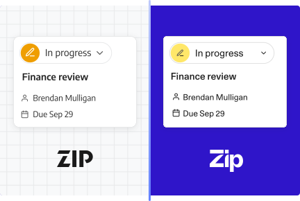

# Brand 2.0 — complete case-study reference

This public reference preserves the complete semantic copy of the [Brand 2.0 case-study page](https://www.hunt.codes/projects-and-toys/brand-2-case-study), including its captions, image descriptions, data table, and navigation. Keep it in sync with [the page component](../../src/Brand2CaseStudy.tsx); `Brand2CaseStudy.copy.test.js` checks coverage. This is a public case-study reference, not a private interview evidence file.

[Home](https://www.hunt.codes/home)

[Projects & toys](https://www.hunt.codes/projects-and-toys) / Case study

# Rebranding a live enterprise app, one flag at a time

I was the engineering lead for Zip’s Brand 2.0 product migration: a marketing rebrand that became a component-library and UX overhaul. We kept both brands in the live application, rolled the new experience out in customer cohorts, and treated retiring the old code as a separate phase. The hard part was changing shared component contracts while teams and customers still depended on them.

- **Components rebuilt**: ~20
- **Components restyled**: 100+
- **Duplicate components retired**: ~12
- **isBrand2 references left · Dec 9**: 0

Component counts are my approximate project-wide totals, not individual output; the categories may overlap. The zero-reference endpoint comes from the December 9 cleanup PR.

- Design systems
- Migrations
- Technical leadership
- Zip · Jul 2024 to Jan 2025
- Role: project engineering lead
- Team: designers and frontend engineers across product teams

## In this case study

- [Context](#cs-context)
- [Engineering approach](#cs-approach)
- [Rollout and cleanup](#cs-rollout)
- [Takeaways](#cs-takeaways)

01 · Context

## A rebrand that became a revamp

Brand 2.0 began as a brand and marketing effort: a new logo, a new palette, new type. On the product side, it created room for a component-library rebuild that I remember the frontend team wanting for years. Customers were already preparing for a different experience, so we could propose related UX changes alongside the visual refresh. That was an opportunity, not a reason to ship every behavior change at once.

The result was effectively a revamp of the whole web app: a new design system, Birch, replacing Aspen; around twenty core components rebuilt from scratch and more than a hundred restyled; a dozen duplicate library components retired; and a long list of customer-requested improvements folded in. I remember customers who heard about it early asking to switch ahead of their scheduled cohort. That was encouraging feedback, not a measured adoption result.

Zip’s brand team told the marketing side of the story in [Designing the flow of business](https://zip.com/blog/zip-brand-story): a brand built on two ideas, flow and peak, a wordmark drawn from motion, and a palette revised with accessibility in mind. That describes the design intent, not a product-wide compliance result. The post also says the designers folded the new language straight into the product, paying down design debt and refining the core components as they went. This page is the engineering side of that sentence: how we changed a live application through an incremental customer transition.

The request page in Aspen and in Birch, from Zip’s launch materials. These are different example requests, not a controlled before-and-after usability comparison.

02 · Approach

## One codebase, independent rollout controls

As I recall, our largest enterprise customers wanted roughly three months from alpha through beta to launch, with little tolerance for disruption. A long-lived redesign branch would concentrate integration risk. Keeping both experiences in the main application let us merge incrementally and expose the new brand to successive cohorts. Early customers willing to try it helped us find issues before the more cautious cohorts joined. The cost was temporary branching in shared code, more visual review, and an explicit cleanup phase.

### How it ran both ways

**A main brand flag, plus independent controls.**

isBrand2 selected the main brand experience. Date pickers, dropdown inputs and the launch announcement had separate flags, so they could ship or hold on their own schedules. Not every related fix depended on the brand flag.

**A toggle for customers, with feedback attached.**

The broad opt-in phase let customers switch brands themselves. The customer toggle also provided a feedback form during the wider rollout.

**Query params for testing.**

The b1 and b2 query parameters let reviewers select a brand from a review link, making it easier to compare the same change in both experiences.

**Snapshots of both worlds.**

During migration, a second Chromatic job ran the Storybook suite under the new brand alongside the original suite. On October 24, near GA, we switched the primary job to Brand 2 and removed the duplicate job. Dual-brand snapshots did not continue through code retirement.

**MUI underneath.**

ZSidePanel moved to MUI Drawer; other modal components already used MUI. The pill select already used MUI Select, and we simplified its API. We also switched text skeletons to MUI’s text variant on targeted surfaces. Shared primitives reduced custom behavior, but focus and layering still needed integration testing.

### A typography change was an API migration

ZText’s default size changed from 16px to 14px. We first made existing size choices explicit at call sites and required them in TypeScript, then normalized conditional size props, changed the default, and finally removed redundant explicit sizes. The preparation PR touched 631 files; the final cleanup touched 1,135. Those are separate PR sizes, not unique files across the project. The staged sequence made each contract change reviewable, at the cost of broad mechanical diffs and coordination with teams editing the same code.

### Standardize intent, not just appearance

The pill-select API gained semantic variants and getOptionLabel, while keeping custom rendering available for cases that needed it. We also removed a redundant “clear condition” pill where the autocomplete already provided clearing. The goal was to make the shared component the straightforward choice, without forcing every interaction into an identical shape.

### How the work was divided

I was the lead engineer. Most of the job was splitting the migration into work each product team could own, in two shapes. Component migrations: replace every use of a legacy component in your code with its rebuilt version, which carries the new brand, the improved UX and the engineering cleanup at once. Design migrations: work with your designer to bring a page, or a bespoke component your team owns, onto the new brand. A migration tracker assigned owners to the legacy modals we had identified. Later audits found both newly split components and unassigned call sites; the initial inventory was not complete.

Design shipped specs in weekly batches. Another frontend engineer and I divided each batch and worked the questions back with the designer directly. I remember roughly seventy polish PRs, an estimate rather than a complete project PR count. Weekly batches gave us a regular place to resolve design questions instead of relying only on individual code reviews.

### What I owned

- Keeping both brands in the main application, rather than accumulating the redesign on a long-lived branch.
- Owning the second Chromatic configuration during dual-brand development.
- Using MUI primitives for shared overlays, including the side-panel migration.
- Implementing finer rollout controls with the team, plus the customer toggle and feedback path.
- Per-environment favicons to make development and production tabs easier to distinguish.
- The find-and-replace cleanup strategy, backed by type checks, visual review and follow-up fixes.
- Most of the changes to the core component library itself.

03 · Rollout

## Launch in rings, then delete the old brand

The brand launch, replacement-component rollout and code retirement were different milestones. Immediately before GA, we kept the replacement date pickers behind their own flag and styled the existing pickers for the new brand. The migration also had to preserve invalid-input handling, the null value contract, internal versus consumer-provided errors, and a stable clear-button identity. A visual refresh did not remove those behavioral obligations.

Customer rollout and code retirement · July 2024 to January 2025

1. **Jul 2024** The new logo lands in the codebase and the migration starts behind the flag.
2. **Aug** Design partners go first. Dual-brand Storybook snapshots begin after a failed initial setup and a retry.
3. **Late Aug to Sep** Beta: about 30 companies, in two tranches.
4. **Sep 24** Broad opt-in opens with a customer toggle and welcome modal.
5. **Oct 24** The primary Chromatic job switches to Brand 2; the duplicate job is removed.
6. **Oct 25** Main-product general availability. Replacement date pickers remain separately gated; Discover follows later.
7. **Oct 28** Zip publishes the brand story.
8. **Early Nov** Discover follows, the last surface in my rollout account.
9. **Nov 18** The first numbered cleanup PR merges, ahead of toggle removal.
10. **Nov 21** Customer toggle-removal milestone; the PR removing the toggle code merges November 23.
11. **Dec 9** The PR removing the last isBrand2 references merges.
12. **Jan 10, 2025** The ninth numbered cleanup PR merges, not the end of all Brand work.
13. **Jan 13–14** Follow-through continues: shared upload components reach four surfaces, followed by sandbox navigation and theme-color cleanup.

Customer dates and cohort sizes are from my project account; code events are PR merge dates, not deployment timestamps. The numbered cleanup series is only part of the follow-through.

The welcome modal’s art: the same card in Aspen and in Birch, from Zip’s launch materials

I don’t recall new bug reports arriving through the wide-rollout feedback form. That does not mean the launch was bug-free: issues reached us through customer success, dogfooding and QA. My project account records more than thirty closed support tickets, including bugs and feature requests. That is work completed, not a measured reduction in ticket volume. The rebrand gave us room to address requests that otherwise would have waited.

### The cleanup

Cleanup started before the customer toggle disappeared. One find-and-replace pass removed roughly four hundred flag references; the last isBrand2 references were removed in the December 9 PR. Type checks and visual review helped, but neither guaranteed that every usage was correct. The later work removed no-op props, retired ZButton’s small and large size aliases, and unified color constants. Nine numbered cleanup PRs merged from November 18 through January 10, with other cleanup and component-adoption PRs outside that series.

Gross lines deleted: 15,952 across nine numbered cleanup PRs

| Cleanup PR                   | Lines deleted | Lines added |
| ---------------------------- | ------------: | ----------: |
| 1 · Alerts and toasts        |           611 |         126 |
| 2 · Find-and-replace pass    |         1,118 |         409 |
| 3 · Brand-name references    |         3,115 |         643 |
| 4 · Announcement and toggle  |         4,575 |         756 |
| 5 · Library-folder styles    |         2,463 |         554 |
| 6 · Last isBrand2 references |         1,566 |         573 |
| 7 · ZButton size aliases     |         1,326 |         477 |
| 8 · No-op props              |           451 |         232 |
| 9 · Color constants          |           727 |         359 |

The same nine PRs added 4,129 lines: a net reduction of 11,823. These diff totals describe a selected cleanup series, not all project work or a measured improvement in maintenance time.

### What the safety net missed

The first dual-brand Chromatic setup failed to boot its preview; a retry fixed an environment-variable assumption. Later, Chromatic caught a ZLink usage that depended on inline display, but our stories did not systematically cover every application usage. Beta feedback and targeted QA were still necessary. Standardizing on MUI did not eliminate integration bugs either: the side panel needed a follow-up backdrop-layering fix.

04 · Takeaways

## The rebrand was the excuse. The revamp was the point.

1. **Use the rebrand as an opening, not a blank check.** Customers were already preparing for a different experience, which created room for related UX improvements. Behaviorally risky replacements still needed separate rollout decisions.
2. **Let early cohorts inform the next release.** Customers willing to try the new experience helped us find issues before wider rollout. By general availability, early cohorts had used the new brand for roughly two months.
3. **Snapshot both worlds.** Dual-brand visual diffs made appearance changes inspectable during migration. They did not cover every application usage or replace behavioral testing, and we retired the extra job near GA.
4. **Code retirement is a separate deliverable.** The last isBrand2 references were removed on December 9, under three weeks after the customer toggle-removal milestone. Cleanup had started earlier and broader adoption work continued in January. Next time, I would make removal criteria and ownership explicit from the start.
5. **Use the moment to dedupe.** Migrating shared call sites gave us an opportunity to retire roughly a dozen duplicates and simplify the APIs teams would use afterward.

Customers are unnamed. Component and cohort counts are approximate; PR file and line counts describe specific changes, not business impact. The two images are from Zip’s launch materials. No internal source code, dashboards, or schemas are reproduced here.

**Related:** [Designing the flow of business](https://zip.com/blog/zip-brand-story), Zip’s own telling of the rebrand, and [the request-page case study](https://www.hunt.codes/projects-and-toys/rdp-case-study).

## More from Andrew

- [About](https://www.hunt.codes/about)
- [Back to Projects](https://www.hunt.codes/projects-and-toys)
- [Email Andrew](mailto:andrew@hunt.codes?Subject=Brand%202.0%20case%20study)
